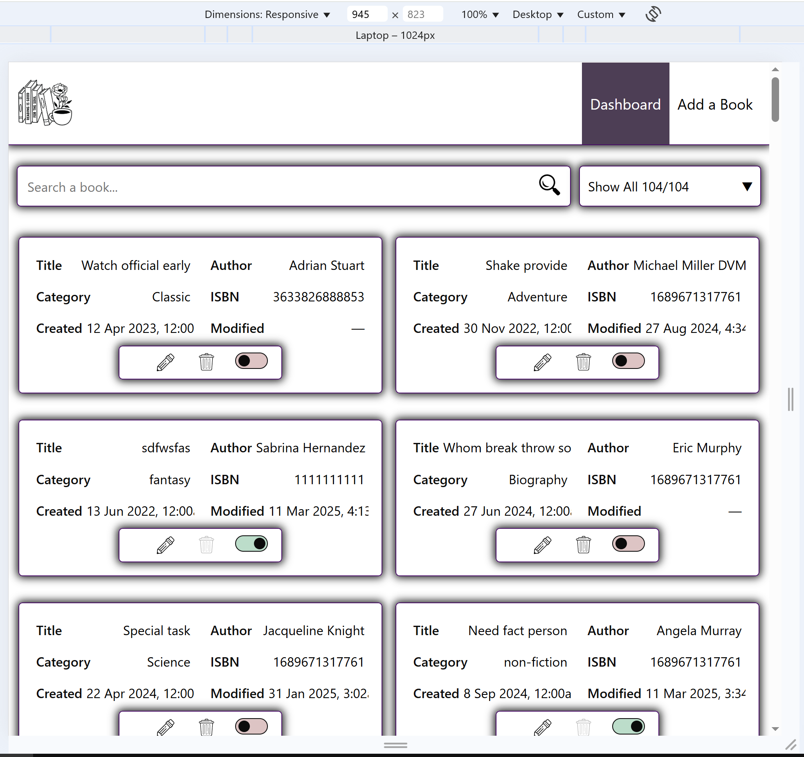
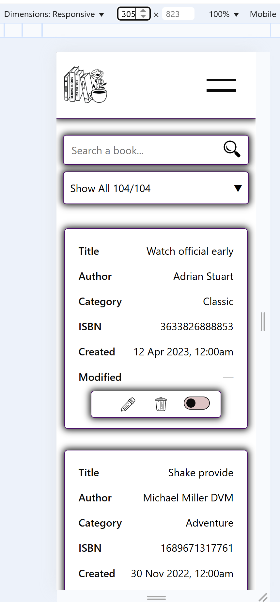
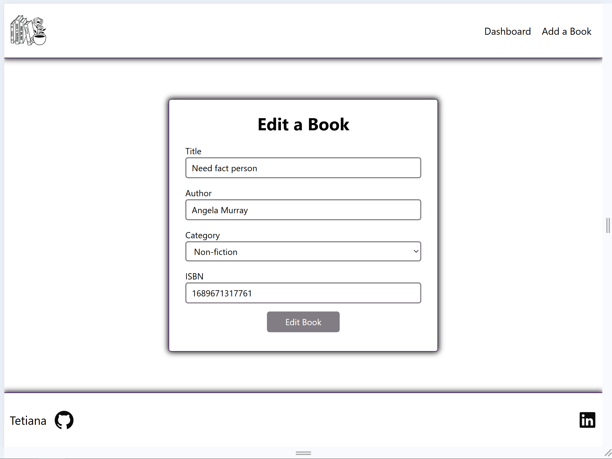

# Demo Book List

This project is a **React** application to manage a book list using a fake REST API. The application supports CRUD operations and follows the REST architecture principles.

## [Specifications Link](https://github.com/Tetiana-KET/demo_book_list/blob/main/SPECS.md)

## Features

- **Dashboard** displaying a table of books with the following columns
- Filter options to display books based on their status (Active, Deactivated, or All).
- Add and Edit books with a form, which includes:
- Responsive layout.
- Sticky footer, when page content is short, with a link to the GitHub profile.







## Setup

To run the project locally, follow these steps:

### Prerequisites

Ensure you have the following installed:

- **Node.js** (v14.x or later)
- **npm** (v6.x or later)

### Install dependencies

1. Clone this repository to your local machine:

   ```bash
   https://github.com/Tetiana-KET/demo_book_list.git
   cd demo-book-list
   ```

2. Install the required dependencies:

   ```bash
   npm install
   ```

### Run the fake REST API server

This application uses a fake REST API powered by **JSON Server**.

1. **Clone** the repository for the fake server:

   ```bash
   git clone https://github.com/typicode/json-server
   ```

2. **Install json-server**

   ```bash
   npm install json-server
   ```

3. **Navigate to the folder** where you have the `db.json` file:

   ```bash
   cd path-to-your-json-server-folder
   ```

4. **Start the server** using the following command:

   ```bash
   npx json-server db.json
   ```

   This will start the API server on `http://localhost:3000`.

5. **For the server to work, you can use the example database provided in the `example.db.json` file in this repository.**

### Run the React app

1. In the root folder of your **React app**:

   ```bash
   npm run dev
   ```

2. Navigate to the app in your browser:

   [http://localhost:5173](http://localhost:5173)

You should now be able to see the **Dashboard** with all the functionalities for managing books.

## Development

- Use **React** and **TypeScript** for the front-end.
- **JSON Server** handles the backend for CRUD operations (Create, Read, Update, Delete).
- The application uses **hooks** and **custom hooks** where necessary.
- Styling is done using **SCSS**.

## Limitations

- No third-party libraries like **Redux**, **Axios**, **Formik**, **Yup**, **React-Hook-Form**, etc., were used as per the requirements.
